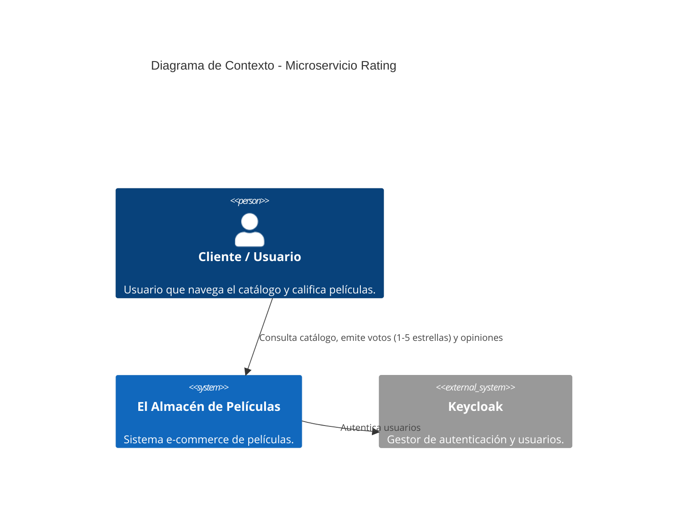
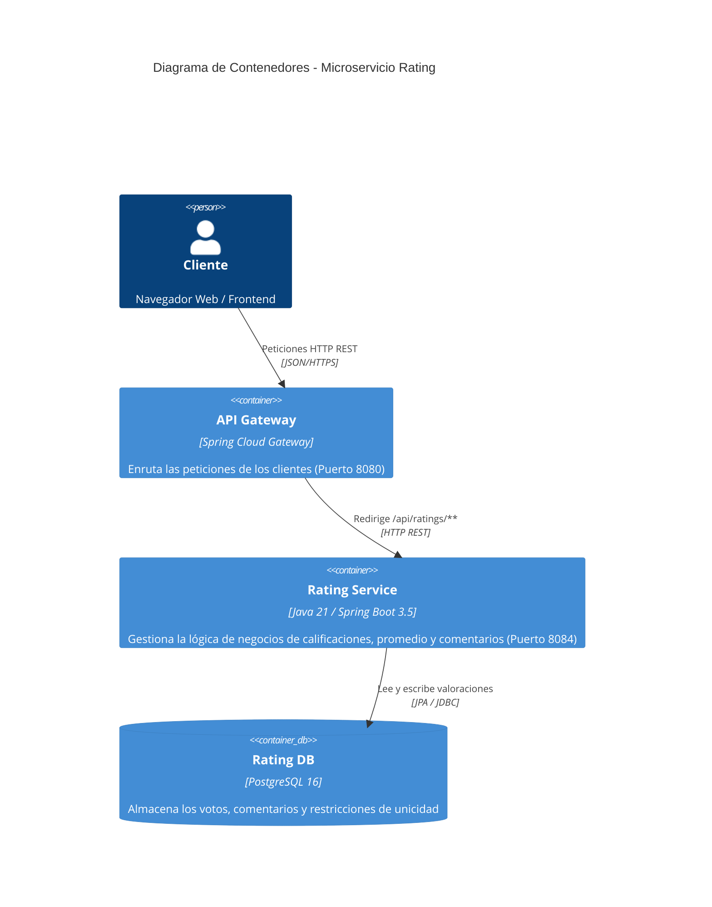

# Vertical Rating - Microservicio Backend

Este microservicio forma parte del sistema **El Almacén de Películas Online** y se encarga de gestionar la calificación (de 1 a 5 estrellas) y las opiniones/comentarios realizadas por los clientes sobre las películas del catálogo.

---

## 🎯 1. Propósito y Visión General

El microservicio `rating-backend` implementa los requerimientos funcionales **RF-2** (Detalle de Película - Rating promedio y lista de opiniones) y **RF-11** (Rating de películas - Permitir a los clientes calificar y comentar una sola vez por película).

### Funcionalidades Principales
- **Registro de Voto y Comentario**: Permite a un cliente autenticado emitir una valoración de 1 a 5 estrellas acompañada opcionalmente de un texto descriptivo.
- **Validación de Unicidad**: Garantiza mediante restricciones de negocio y base de datos que un cliente no pueda calificar la misma película más de una vez.
- **Cálculo de Rating Promedio**: Proporciona el cálculo agregado en tiempo real del promedio de estrellas (redondeado a 2 decimales) y el total de votos recibidos.
- **Consultas de Votos por Película y Usuario**: Permite obtener el listado ordenado cronológicamente de opiniones y verificar si un cliente ya emitió su voto para una película.

---

## 📡 2. Servicios Expuestos vía HTTP (API REST)

Base URL: `http://localhost:8084/api/ratings`

| Método | Endpoint | Descripción | Estado HTTP |
| :--- | :--- | :--- | :--- |
| `GET` | `/api/ratings/pelicula/{peliculaId}` | Obtiene la lista de valoraciones y comentarios de una película ordenados por fecha descendente. | `200 OK` |
| `GET` | `/api/ratings/pelicula/{peliculaId}/promedio` | Obtiene el promedio de estrellas y la cantidad total de votos para una película. | `200 OK` |
| `GET` | `/api/ratings/pelicula/{peliculaId}/usuario/{usuarioId}/voto` | Obtiene la valoración realizada por un usuario en una película específica. | `200 OK` / `404 Not Found` |
| `GET` | `/api/ratings/pelicula/{peliculaId}/usuario/{usuarioId}/ha-votado` | Verifica explícitamente si un usuario ya emitió su voto para una película. | `200 OK` |
| `GET` | `/api/ratings/{id}` | Obtiene el detalle de una valoración individual por su ID. | `200 OK` / `404 Not Found` |
| `POST` | `/api/ratings` | Registra una nueva valoración y comentario. | `201 Created` / `400 Bad Request` / `409 Conflict` |
| `DELETE` | `/api/ratings/{id}` | Elimina una valoración por su ID. | `204 No Content` / `404 Not Found` |

### 📝 Estructura de DTOs

#### RatingDTO (`POST /api/ratings` y respuestas de consulta)
```json
{
  "id": 1,
  "usuarioId": "usr_9981",
  "peliculaId": 10,
  "estrellas": 5,
  "comentario": "Excelente película, gran banda sonora.",
  "fecha": "2026-07-22T20:00:00"
}
```

#### RatingPromedioDTO (`GET /api/ratings/pelicula/{peliculaId}/promedio`)
```json
{
  "peliculaId": 10,
  "promedio": 4.75,
  "totalVotos": 12
}
```

#### VotoUsuarioStatusDTO (`GET /api/ratings/pelicula/{peliculaId}/usuario/{usuarioId}/ha-votado`)
```json
{
  "peliculaId": 10,
  "usuarioId": "usr_9981",
  "haVotado": true
}
```

---

## 🔄 3. Eventos Publicados y Consumidos

### Modelo de Integración Actual
- **Modo de Operación**: `rating-backend` opera como un microservicio sincrónico expuesto mediante interfaz **HTTP REST**.
- **Eventos Publicados**: Ninguno por el momento. Las actualizaciones de valoraciones son consultadas directamente en tiempo real por la aplicación frontend o a través del API Gateway.
- **Eventos Consumidos**: Ninguno por el momento. No depende de eventos asincrónicos para su funcionamiento básico, manteniendo un bajo acoplamiento con la mensajería de compras o usuarios.

*(Nota: El sistema está diseñado para conectarse fácilmente al broker RabbitMQ mediante `spring-boot-starter-amqp` si en el futuro se requiere publicar eventos como `rating.creado` o `rating.eliminado`)*.

---

## 🏗️ 4. Arquitectura y Diagramas C4

### Diagrama Nivel 1: Contexto del Sistema



### Diagrama Nivel 2: Contenedores



---

## 🧪 5. Ejecución de Pruebas Automatizadas

El proyecto incluye una suite completa de pruebas unitarias e integración de acuerdo a las buenas prácticas del proyecto:
- **Dominio**: Pruebas de entidad `Rating` y callbacks JPA (`RatingTest`).
- **Persistencia**: Pruebas con `@DataJpaTest` y base de datos H2 en memoria (`RatingRepositoryTest`).
- **Servicio**: Pruebas unitarias aisladas con Mockito (`RatingServiceTest`).
- **Controlador**: Pruebas Web MVC con `@WebMvcTest` y `MockMvc` (`RatingControllerTest`).

Para ejecutar todas las pruebas y generar el reporte:
```bash
./mvnw clean test
```

---

## 🚀 6. Despliegue y Ejecución Local

### Opción A: Con Docker Compose (Recomendado)
```bash
docker compose up -d --build
```
Esto levantará el contenedor de PostgreSQL (`rating-db`) en el puerto 5432 y la aplicación Spring Boot (`rating-app`) en el puerto 8084.

### Opción B: Ejecución Local con Maven
1. Asegúrate de tener una instancia de PostgreSQL o H2 en ejecución configurada en `application.properties`.
2. Ejecuta:
```bash
./mvnw spring-boot:run
```

### 📖 Documentación OpenAPI / Swagger UI
Una vez iniciado el microservicio, accede a la documentación interactiva en:
- `http://localhost:8084/swagger-ui.html`
- `http://localhost:8084/v3/api-docs`
